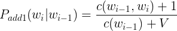

# Language Modeling - Foundations

Assumptions and terminology
We will assume that text data is in the form of sentences with no punctuation. If a sentence is in a single line, we will add add a token for start of sentence: `<s> and end of sentence: </s>.` For example, if the sentence is "I love language models." it will appear in code as:

`I love language models`
The tokens for this sentence are represented as an ordered list of the lower case words plus the start and end sentence tags:

tokens = `['<s>', 'i', 'love', 'language', 'models', '</s>']`

The bigrams for this sentence are represented as a list of lower case ordered pairs of tokens:

bigrams = `[('<s>', 'i'), ('i', 'love'), ('love', 'language'), ('language', 'models'), ('models', '</s>')]`


In the following section we have a function that returns a list of tokens and a list of bigrams for a given sentence. You will need to first break a sentence into words in a list, then add a ``<s> and <s/>`` token to the start and end of the list to represent the start and end of the sentence.

Your final lists should be in the format shown above and called out in the function doc string.


```python
test_sentences = [
    'the old man spoke to me',
    'me to spoke man old the',
    'old man me old man me',
]

def sentence_to_bigrams(sentence):
    """
    Add start '<s>' and stop '</s>' tags to the sentence and tokenize it into a list
    of lower-case words (sentence_tokens) and bigrams (sentence_bigrams)
    :param sentence: string
    :return: list, list
        sentence_tokens: ordered list of words found in the sentence
        sentence_bigrams: a list of ordered two-word tuples found in the sentence
    """
    sentence_tokens = ['<s>'] + sentence.lower().split() + ['</s>']
    sentence_bigrams = []
    for i in range(len(sentence_tokens)-1):
        sentence_bigrams.append((sentence_tokens[i], sentence_tokens[i+1]))
    return sentence_tokens, sentence_bigrams

sentence_to_bigrams(test_sentences[0])
```


    (['<s>', 'the', 'old', 'man', 'spoke', 'to', 'me', '</s>'],
     [('<s>', 'the'),
      ('the', 'old'),
      ('old', 'man'),
      ('man', 'spoke'),
      ('spoke', 'to'),
      ('to', 'me'),
      ('me', '</s>')])


Probabilities and Likelihoods with Bigrams
Recall from a previous video that the probability of a series of words can be calculated from the chained probabilities of its history:


The probabilities of sequence occurrences in a large textual corpus can be calculated this way and used as a language model to add grammar and contectual knowledge to a speech recognition system. However, there is a prohibitively large number of calculations for all the possible sequences of varying length in a large textual corpus.

To address this problem, we use the Markov Assumption to approximate a sequence probability with a shorter sequence:


In the bigram case, the equation reduces to a series of bigram probabilities multiplied together to find the approximate probability for a sentence. A concrete example:


We can calculate the probabilities by using counts of the bigramsand individual tokens. The counts are represented below with the c() operator:


In Python, the Counter method is useful for this task


```python
from collections import Counter
# Sentence: "I am as I am"
tokens = ['<s>', 'i', 'am', 'as', 'i', 'am', '</s>']
token_counts = Counter(tokens)
print(token_counts)
# output:
# Counter({'</s>': 1, '<s>': 1, 'am': 2, 'as': 1, 'i': 2})
```

    Counter({'i': 2, 'am': 2, '<s>': 1, 'as': 1, '</s>': 1})
    


```python
from collections import Counter
import utils

def bigram_mle(tokens, bigrams):
    """
    provide a dictionary of probabilities for all bigrams in a corpus of text
    the calculation is based on maximum likelihood estimation and does not include
    any smoothing.  A tag '<unk>' has been added for unknown probabilities.
    :param tokens: list
        tokens: list of all tokens in the corpus
    :param bigrams: list
        bigrams: list of all two word tuples in the corpus
    :return: dict
        bg_mle_dict: a dictionary of bigrams:
            key: tuple of two bigram words, in order OR <unk> key
            value: float probability
            
    """
    bg_mle_dict = {}
    bg_mle_dict['<unk>'] = 0.

    token_raw_counts = Counter(tokens)
    bigram_raw_counts = Counter(bigrams)
    for bg in bigram_raw_counts:
        bg_mle_dict[bg] = bigram_raw_counts[bg] / token_raw_counts[bg[0]]
    return bg_mle_dict

tokens = []
bigrams = []
for line in test_sentences:
    line_tokens, line_bigrams = sentence_to_bigrams(line)
    tokens = tokens + line_tokens
    bigrams = bigrams + line_bigrams
    
bigram_mle(tokens, bigrams)
```


    {'<unk>': 0.0,
     ('<s>', 'the'): 0.3333333333333333,
     ('the', 'old'): 0.5,
     ('old', 'man'): 0.75,
     ('man', 'spoke'): 0.25,
     ('spoke', 'to'): 0.5,
     ('to', 'me'): 0.5,
     ('me', '</s>'): 0.5,
     ('<s>', 'me'): 0.3333333333333333,
     ('me', 'to'): 0.25,
     ('to', 'spoke'): 0.5,
     ('spoke', 'man'): 0.5,
     ('man', 'old'): 0.25,
     ('old', 'the'): 0.25,
     ('the', '</s>'): 0.5,
     ('<s>', 'old'): 0.3333333333333333,
     ('man', 'me'): 0.5,
     ('me', 'old'): 0.25}


Smoothing and logs
There are still a couple of problems to sort out before we use the bigram probability dictionary to calculate the probabilities of new sentences:

1. Some possible combinations may not exist in our probability dictionary but are still possible. We don't want to multiply in a probability of 0 just because our original corpus was deficient. This is solved through "smoothing". There are a number of methods for this, but a simple one is the Laplace smoothing with the "add-one" estimate where `V` is the size of the vocabulary for the corpus, i.e. the number of unique tokens


2. Repeated multiplications of small probabilities can cause underflow problems in computers when
the values become to small. To solve this, we will calculate all probabilities in log space


a utility named utils.bigram_add1_logs has been added for you with Laplace smoothing in the log space. Write a function that calculates the log probability for a given sentence, using this log probability dictionary. If all goes well, you should observe that more likely sentences yield higher values for the log probabilities.


```python
import utils

test_sentences = [
    'the old man spoke to me',
    'me to spoke man old the',
    'old man me old man me',
]

def sample_run():
    # sample usage by test code (this definition not actually run for the quiz)
    bigram_log_dict = utils.bigram_add1_logs('transcripts.txt')
    for sentence in test_sentences:
        print('*** "{}"'.format(sentence))
        print(log_prob_of_sentence(sentence, bigram_log_dict))

def log_prob_of_sentence(sentence, bigram_log_dict):
    # get the sentence bigrams
    s_tokens, s_bigrams = utils.sentence_to_bigrams(sentence)

    # add the log probabilites of the bigrams in the sentence
    total_log_prob = 0.
    for bg in s_bigrams:
        if bg in bigram_log_dict:
            total_log_prob = total_log_prob + bigram_log_dict[bg]
        else:
            total_log_prob = total_log_prob + bigram_log_dict['<unk>']
    return total_log_prob

sample_run()
```

    *** "the old man spoke to me"
    -34.80495531345013
    *** "me to spoke man old the"
    -39.34280606002005
    *** "old man me old man me"
    -36.59899481268447
    


```python

```
